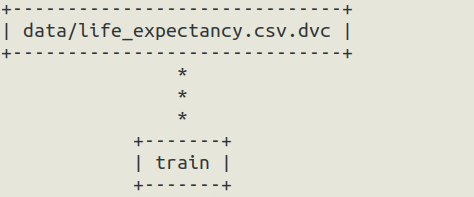
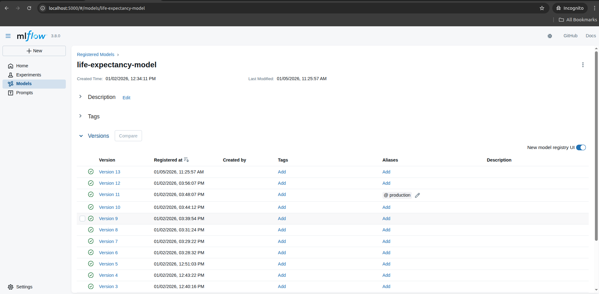
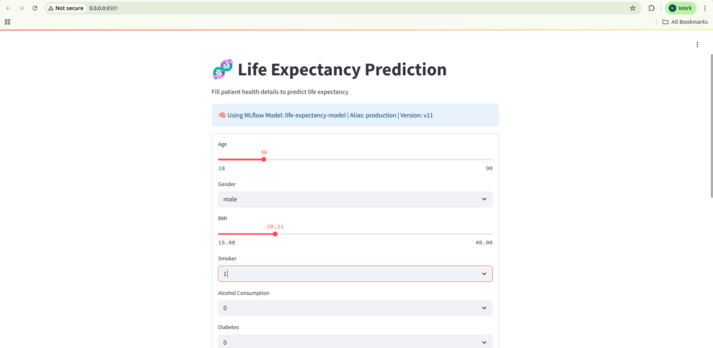
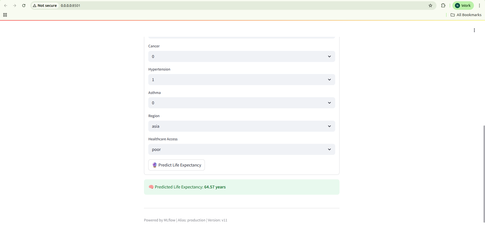
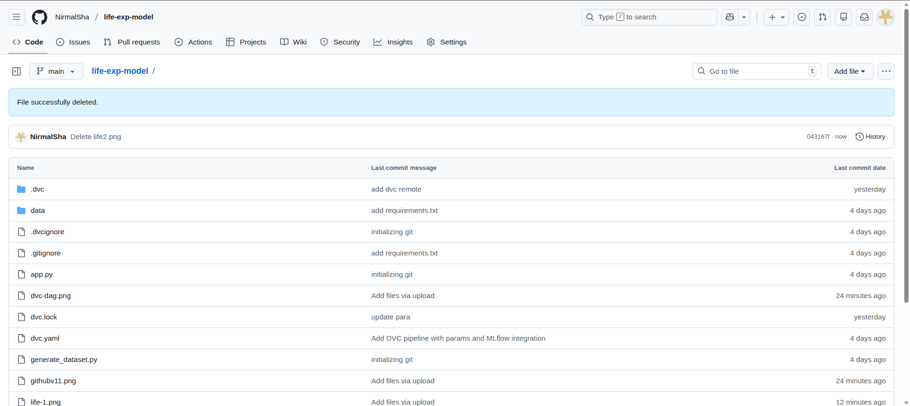

# 🧬 Life Expectancy Prediction — MLOps Pipeline (Local)

This repository demonstrates a **production-style MLOps workflow** built from a **DevOps and platform engineering perspective**, with a focus on **reproducibility, versioning, and lifecycle management** of machine learning models.

The objective of this project is **not ML research**, but to show **how ML systems are engineered, tracked, and served** using modern MLOps tools.

All components run **locally**.

---

## 🚀 Project Overview

The pipeline predicts **life expectancy** based on health and demographic features, while showcasing:

- Reproducible ML pipelines
- Data and experiment versioning
- Model registry–driven serving
- Zero-code-change model switching


## 🏗️ Architecture


Git (code)
│
├── DVC

│ ├── data versioning

│ ├── pipeline orchestration (dvc.yaml)

│ └── reproducibility (dvc.lock)

│
├── MLflow

│ ├── experiment tracking

│ ├── metrics & parameters

│ └── model registry (versions & aliases)

│
└── Streamlit

└── inference UI (loads model from registry)

---

## 🔁 DVC Pipeline (Reproducible Training)

The ML training workflow is defined using **DVC**, enabling deterministic and reproducible runs.

### Pipeline Graph


- Dataset is versioned with DVC
- Training re-runs only when data or parameters change
- Exact pipeline state is captured in `dvc.lock`

---

## 📊 Experiment Tracking & Model Registry (MLflow)

MLflow is used for:
- Experiment tracking (metrics and parameters)
- Automatic model versioning
- Controlled promotion using registry aliases

### MLflow Model Registry


Each `dvc repro` execution:
- Logs a new experiment
- Registers a new model version
- Preserves full reproducibility

---

## 🟢 Live Application (Local)

The trained model is served locally using a **Streamlit application**.  
The application dynamically loads the **production model** from the MLflow Model Registry.

### Live Prediction UI




The UI clearly displays:
- Model name
- Active registry alias (`production`)
- Model version currently serving predictions
- Real-time prediction output

This confirms the full **train → register → serve** lifecycle is working end-to-end.

---

## 🧠 Key MLOps Insight

> **The application does not decide which model runs.  
> The Model Registry does.**

Changing the `production` alias in MLflow updates the served model **without any code changes or redeployment**, enabling safe promotion and rollback.

---

## 📁 Repository Structure



.
├── app.py # Streamlit inference UI

├── train.py # Training & MLflow logging

├── params.yaml # Model hyperparameters (config-driven)

├── dvc.yaml # DVC pipeline definition

├── dvc.lock # Exact pipeline state

├── data/

│ └── life_expectancy.csv.dvc

├── artifacts/

│ └── metrics.json

├── generate_dataset.py

├── requirements.txt

└── README.md

---

## 🛠️ Tech Stack

- **Python**
- **DVC** – data and pipeline versioning
- **MLflow** – experiment tracking & model registry
- **Streamlit** – inference UI
- **Git**
- **Linux**

---

## ▶️ How to Run (Local)

### 1️⃣ Clone the repository
```bash
git clone https://github.com/NirmalSha/life-exp-model.git
cd life-exp-model
2️⃣ Create virtual environment

python3 -m venv .venv
source .venv/bin/activate
pip install -r requirements.txt
3️⃣ Start MLflow server

mlflow server \
  --backend-store-uri sqlite:///mlflow.db \
  --default-artifact-root ./mlflow-artifacts \
  --host 0.0.0.0 \
  --port 5000

4️⃣ Run training pipeline

dvc repro

5️⃣ Run Streamlit app

streamlit run app.py
```

---

🎯 What This Project Demonstrates
DevOps principles applied to ML workflows

Reproducible and auditable ML pipelines

Registry-driven model serving

Clean separation of concerns:

Git → Code

DVC → Data & pipeline

MLflow → Models


